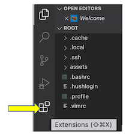
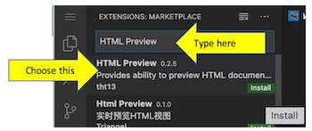
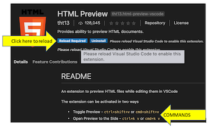

# IMPORTANT INFORMATION NEEDED TO PREVIEW THE HTML PAGES

Whilst HTML is supported 'straight out of the box' in Visual Studio Code and the editor helps us code correctly, **there is no HTML preview** without installing an extension. So, we need to install an extension such as **HTML Preview** from the **VS Code Marketplace**.

## Installing HTML Preview

With Visual Studio Code open:

- click on the **Extensions** icon.


- type HTML Preview in the search box.
- choose the HTML Preview extension that appears at the top, as shown in the image.
  
- click on the **Install** button.
- click on the Reload button, to reload the Visual Studio Code editor.
    

Now when we have our HTML code open in Visual Studio Code we can preview it by using the command relevant to our computer:

- if we use a Mac   - command+shift+v
- if we use Windows - ctrl+shift+v

### INTRODUCTION TO OUR TASK

We start with a basic Hypertext Markup Language page, HTML page, and then add **CSS** to the HTML page. CSS means **Cascading Style Sheet** and allows us to apply a style to elements of the HTML page. Rather than writing our own CSS we can use a CSS library like Bootstrap where the styling is written for us and we simply have to apply the appropfriate style to the HTML controls.

The page we are starting with is the page that is produced once the HTML scenario has been completed. So, if we have completed the HTML scenario then the HTML code will be very familair, on the other hand if this is the first time seeing the HTML code then look through it to understand the various controls.

The steps we will complete are aimed at developing the CSS piece by piece and creating a HTML form which has an acceptable **UI (user interface)**. Whilst the application is to simulate an insurance quote application where a user completes a form and receives a quote amount it is equally important that the user has a good **UX (user experience)**.

In completing this scenario we can copy and paste the code included in these instructions **but it is much better to type the code ourselves**. It is only by practice, making mistakes and correcting the mistakes that our learning is reinforced.

#### Let's create some code

1. We will now open the HTML starter file by clicking on the link below:
   **`./assets/Step1StarterHTML.html`{{open}}**
  &nbsp;

2. Now we will add the required meta tags for the Bootstrap CSS library within the **`<head>`** and **`</head>`** tags, and specifically here we have them inserted below the ``<title>HTML Forms</title>`` code line. The code analysis at the end of this step gives a full explanation of the code we are adding.

   ```HTML
    <!DOCTYPE html>
    <html lang="en">

    <head>
      <title>HTML Forms</title>

      <!-- Required meta tags -->
      <meta charset="utf-8" />
      <meta name="viewport" content="width=device-width, initial-scale=1, shrink-to-fit=no" />

    ```

3. Now add the link to the Bootstrap stylesheet within the **`<head>`** and **`</head>`** tags. This link points to the file which contains all the Cascading Style Sheet code and is held on a Content Delivery Network (CDN).

   ```HTML
    <!DOCTYPE html>
    <html lang="en">

    <head>
      <title>HTML Forms</title>

      <!-- Required meta tags -->
      <meta charset="utf-8" />
      <meta name="viewport" content="width=device-width, initial-scale=1, shrink-to-fit=no" />

      <!-- Bootstrap CSS -->
      <link rel="stylesheet" href="https://maxcdn.bootstrapcdn.com/bootstrap/3.4.1/css/bootstrap.min.css">
    ```

4. We can also use Bootstrap to do some 'fancy' things and this requires additional files which we should include before the **</body>** tag. For now we will add these JavaScript files even though we may not use them, but we will at least be aware that CSS can use JavaScript.

    ```HTML
    </form>

    <!-- Optional JavaScript -->
    <script src="https://ajax.googleapis.com/ajax/libs/jquery/3.5.1/jquery.min.js"></script>
    <script src="https://maxcdn.bootstrapcdn.com/bootstrap/3.4.1/js/bootstrap.min.js"></script>

    </body>
    </html>
    ```

5. Preview the code using the HTML Preview command relevant to your computer e.g. command+shift+v.

6. Return to the HTML code by clicking on the tab beside this preview tab.

We should see that the web page is slightly different from the original and we will make some further changes to enhance the layout and style of the page.

## CODE ANALYSIS

### Responsive meta tag

From the Bootstrap website we learn that:

- Bootstrap is developed mobile first, a strategy in which we optimize code for mobile devices first and then scale up components as necessary using CSS media queries.
- to ensure proper rendering and touch zooming for all devices, add the responsive viewport meta tag to your ```<head>```.
  ```<meta name="viewport" content="width=device-width, initial-scale=1, shrink-to-fit=no">```

### Link to Bootstrap stylesheet

The link to the Bootstrap stylesheet has to appear within the **`<head>`** and **`</head>`** tags and before all other stylesheets that we may wish to use. The link we are using is shown below but a newer version could be used:
```<link rel="stylesheet" href="https://maxcdn.bootstrapcdn.com/bootstrap/3.4.1/css/bootstrap.min.css">```
