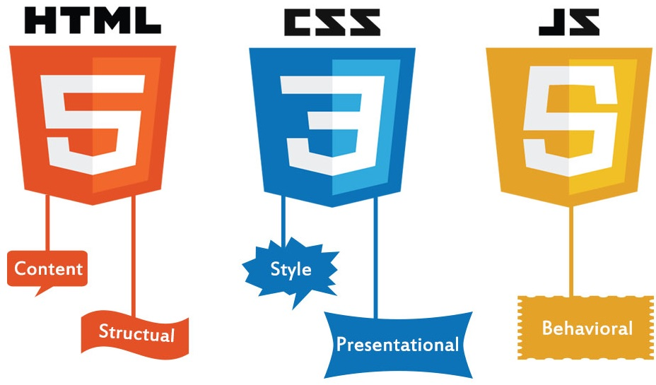

# Designing a simple HTML form

Here we will create a simple **Hypertext Markup Language**, **HTML**, form with some controls.

## What we will do and what we will use

We will develop HTML code using the Visual Studio Code editor to develop a HTML form (the **frontend** application) which can be used later with other scenarios which develop CSS and JavaScript skills.



At the end of this set of scenarios we will be familiar with HTML form tags such as:
 - ```<form>```
 - ```<input>```
 - ```<select>```
 - ```<option>```
 - ```<label>```
  
 and we will have completed a HTML form that accepts user input and could be sent (posted) to an application running on a server (the **backend** application).

In this scenario we will create the base HTML page with a form tag added. The form tag means that data input by the user into the elements enclosed within the ```<form></form>```

Developing frontend skills in HTML, CSS and JavaScript are very important for **Full Stack Development** roles. These skills are frontend skills and the core skill for frontend is HTML.

HyperText Markup Language allows web developers to create and structure such as paragraphs and hyperlinks to plain text which is then displayed in the browser page. HTML can be used for:

- Web development
  - with web development developers use HTML code to design the layout of web pages with their elements such as text, hyperlinks, and input boxes.
  
- Web documentation
  - using Hypertext Markup Language it now possible to create documents, similar to those created in Microsoft Word. The advantage is that we can read such documents in a browser of our choice.
  
## Learning Objectives (what we will actually do)

- we will create a HTML document (page)
- we will create a form within the web page
- we will use different HTML tags
- we will use attributes on HTML tags to customise the tags

## Prerequisite Skills

There are no prerequisites fior this scenario. We just need to believe we can write HTML and this scenario will show us how.

## Table of Contents

The list below shows the related scenarios that culminate in the final form:  

1. creating a basic Hypertext Markup Language document with a form within it
2. adding input boxes to the form.
3. adding an input control of type select to the form.
4. adding an input control of type range to the form.
5. adding an input of type number to the form.
6. adding radio buttons to the form.
7. adding checkboxes to the form.
8. adding date inputs to the form.
9. adding a submit button to the form.
