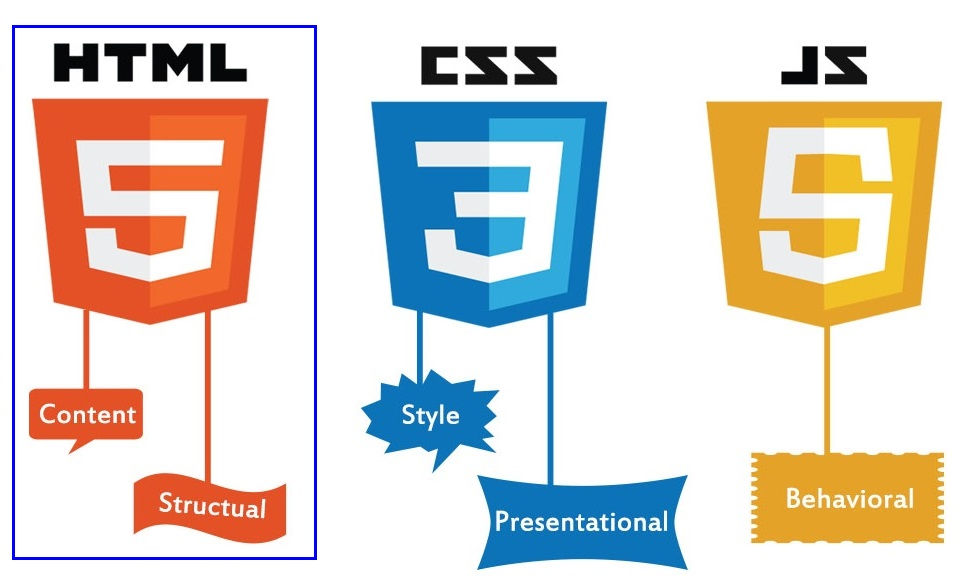
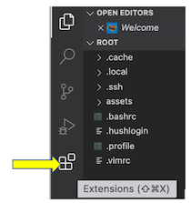
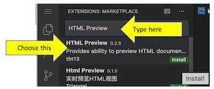
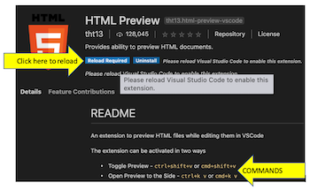

# Designing a simple HTML form

Here we will create a simple **Hypertext Markup Language**, **HTML**, form with some controls.

## What we will do and what we will use

We will use the Visual Studio Code editor to develop a HTML form (the **frontend** application) which can be used later with other scenarios which develop CSS and JavaScript skills.



At the end of this set of scenarios we will be familiar with HTML form tags such as:

- ```<form>```
- ```<input>```
- ```<select>```
- ```<option>```
- ```<label>```
- ```<submit>```

and we will have completed a HTML form that accepts user input and could be sent (posted) to an application running on a server (the **backend** application).

In this scenario we will create the base HTML page with a form tag added. The form tag means that data input by the user into the elements enclosed within the ```<form></form>``` can be sent to a back-end application.

Developing frontend skills in HTML, CSS and JavaScript are very important for **Full Stack Development** roles and the core skill for frontend cevelopment is HTML.

HyperText Markup Language allows web developers to create structure, such as paragraphs and hyperlinks, to plain text which is then displayed in the browser page. HTML can be used for:

- Web development
  - with web development developers use HTML code to design the layout of web pages with their elements such as text, hyperlinks, and input boxes.
  
- Web documentation
  - using Hypertext Markup Language it is now possible to create documents, similar to those created in Microsoft Word or other word processors. The advantage is that we can read such documents in a browser of our choice.
  
## IMPORTANT INFORMATION NEEDED TO PREVIEW THE HTML PAGES

Whilst HTML is supported 'straight out of the box' in Visual Studio Code and the editor helps us code correctly **there is no HTML preview** without installing an extension. So we need to install a extension such as **HTML Preview** from the **VS Code Marketplace**.

So, in step 1 there will be instructions on how to install **HTML Preview** and how to switch between our HTML code and the web page preview. After doing this installation in step 1 there will be no need to repeat it for the other steps as HTML Preview will be avaliable until we close or refresh the scenario. The steps are shown below for reference and will be duplicated in step 1 as it is at this stage that Visual Studio Code is opened.

### Installing HTML Preview

With Visual Studio Code open:

- click on the **Extensions** icon
  ||
  | ----------- |

- type HTML Preview in the search box
- choose the HTML Preview extension that appears at the top, as shown in the image
  ||
  | ----------- |
  
- click on the **Install** button
- click on the Reload button, to reload the Visual Studio Code editor
  ||
  | ----------- |

Now when we have our HTML code open in Visual Studio Code we can preview it by using the command relevant to our computer:

- if we use a Mac   - command+shift+v
- if we use Windows - ctrl+shift+v

Return to the HTML code by clicking on the tab beside this preview tab.

## Learning Objectives (what we will actually do)

- we will create a HTML document (page)
- we will create a form within the web page
- we will use different HTML tags
- we will use attributes on HTML tags to customise the tags

## Prerequisite Skills

There are no prerequisites for this scenario. We just need to believe we can write HTML and this scenario will show us how.

## Table of Contents

The list below shows the related scenarios that culminate in the final form:  

1. creating a basic Hypertext Markup Language document with a form within it
2. adding input boxes to the form.
3. adding an input control of type select to the form.
4. adding an input control of type range to the form.
5. adding an input of type number to the form.
6. adding radio buttons to the form.
7. adding checkboxes to the form.
8. adding date inputs to the form.
9. adding a submit button to the form.
