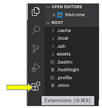

# IMPORTANT INFORMATION NEEDED TO PREVIEW THE HTML PAGES

Whilst HTML is supported 'straight out of the box' in Visual Studio Code and the editor helps us code correctly **there is no HTML preview** without installing an extension. So we need to install a extension such as **HTML Preview** from the **VS Code Marketplace**.

## Installing HTML Preview

With Visual Studio Code open:

- click on the **Extensions** icon



- type HTML Preview in the search box
- choose the HTML Preview extension that appears at the top, as shown in the image
  
- click on the **Install** button
- click on the Reload button, to reload the Visual Studio Code editor
    

Now when we have our HTML code open in Visual Studio Code we can preview it by using the command relevant to our computer:

- if we use a Mac   - command+shift+v
- if we use Windows - ctrl+shift+v

### INTRODUCTION TO OUR TASK

We will create a basic Hypertext Markup Language page, HTML page, and then add a form within the HTML page. This will be the start for other scenarios which will add additional elements to the HTML page within the **`<form>`** and **`</form>`** tags.

The application is to simulate an insurance quote application where a user completes a form and receives a quote amount.

The final code for the basic HTML page in the step will be:

```HTML
<!DOCTYPE html>
<html lang="en">
  <head>
    <title>HTML Forms</title>
  </head>
  <body>
    <h1>Property Insurance Application</h1>
    <h3>GDC Insurance Limited</h3>
  </body>
</html>
```

While the final code in the step including the form tag, ```<form action=""> </form>```, will be:

```HTML
<!DOCTYPE html>
<html lang="en">
  <head>
    <title>HTML Forms</title>
  </head>
  <body>
    <h1>Property Insurance Application</h1>
    <h3>GDC Insurance Limited</h3>

       <form action="">
       </form>
  </body>
</html>
```

In completing this scenario we can copy and paste the code included in these instructions **but it is much better to type the code yourself**. It is only by practice, making mistakes and correcting the mistakes that our learning is reinforced.

###### Let's create some code

1. We will now open the HTML starter file by clicking on the link below:
   **`./assets/Step1StarterHTML.html`{{open}}**
  &nbsp;

2. Now add a title, **HTML Forms**, for the page by adding the text between the tags **`<title>`** and **`</title>`**.

   ```HTML
    <!DOCTYPE html>
      <html lang="en">  
      <head>
        <title>HTML Forms</title>
    </head>
    ```

3. Now add a h1 header, **Property Insurance Application**, to the page by adding the text between the tags **`<h1>`** and **`</h1>`**.

   ```HTML
    <!DOCTYPE html>
    <html lang="en">

    <head>
      <title>HTML Forms</title>
    </head>
    
    <body>
      <h1>Property Insurance Application</h1>
    ```

4. Now add a h3 header, **GDC Insurance Limited**, to the page by adding the text between the tags **`<h3>`** and **`</h3>`**.

   ```HTML
    <!DOCTYPE html>
    <html lang="en">

    <head>
      <title>HTML Forms</title>
    </head>

    <body>
      <h1>Property Insurance Application</h1>
      <h3>GDC Insurance Limited</h3>
   ```

5. Now add the tags required to create a HTML form. The form tag will have an opening tag, **`<form>`** and a matching closing tag **`</form>`**. The form in a HTML page will be located within the **`<body>`** and **`</body>`** tags as shown below:

    ```HTML
    <!DOCTYPE html>
    <html lang="en">

    <head>
        <title>HTML Forms</title>
    </head>

    <body>
        <h1>Property Insurance Application</h1>
        <h3>GDC Insurance Limited</h3>`

        <form action="">
        </form>

    </body>
    </html>
    ```

6. Preview the code using the HTML Preview command relevant to your computer e.g. command+shift+v.

7. Return to the HTML code by clicking on the tab beside this preview tab.

## CODE ANALYSIS

- the DOCTYPE declaration `<!DOCTYPE html>` defines the document type as HTML
- the HTML `<head>` element is a container for other tags such as `<title>, <style>, <meta>, <link>, <script>, <base>`
- the `<title>` element
  - defines the title of the document
  - must contain text-only
  - is required in HTML documents!
  - defines a title in the browser title bar of the pages tab
  - provides a title for the page when it is added to favourites
  - displays a title for the page in search engine-results

- HTML headings are defined with the `<h1>` to `<h6>` tags
  - `<h1>` defines the most important heading
  - `<h6>` defines the least important heading

- the HTML `<form>` tag is used to create an HTML form
- the HTML `</form>` tag is used to close the opening HTML form tag
- the HTML `<form>` tag can be used to manage where and how the details (values) from the form controls will be sent
  - this is achieved by using the
     `<form action="" method="POST">`
  - we can also achieve the sending of the form data by using the
     `<form action="" method="GET">`
